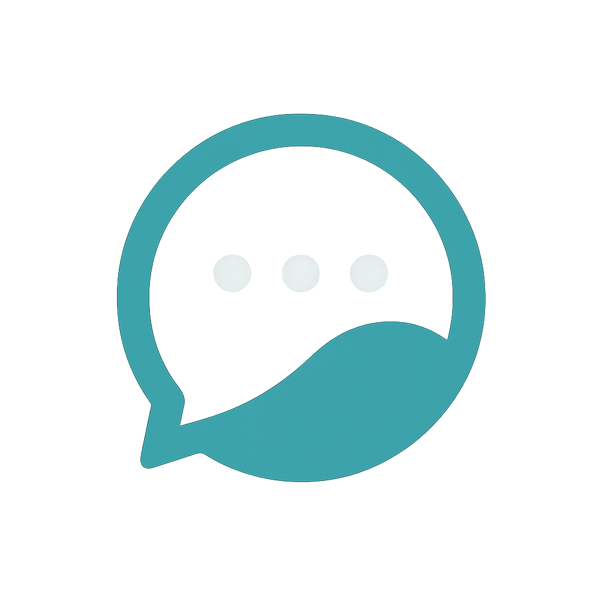

# Chat-Sphere



A modern, responsive chat application built with React, TypeScript, and Material UI. Chat-Sphere provides a feature-rich messaging experience with real-time interactions, media sharing, and AI-powered features.

## ✨ Features

- **Real-time Messaging**: Exchange messages with instant delivery and read receipts
- **Group Conversations**: Create and manage group chats with multiple participants
- **Media Sharing**: Send and receive images, videos, and files
- **Message Reactions**: React to messages with emojis
- **Message Forwarding**: Forward messages between conversations
- **Reply Threads**: Create contextual conversation threads
- **User Profiles**: Customize profiles with avatars and status messages
- **Search Functionality**: Find messages and conversations easily
- **Saved Messages**: Bookmark important messages for later reference
- **Message Deletion**: Delete messages for yourself or everyone
- **Typing Indicators**: See when others are typing
- **Dark/Light Themes**: Choose your preferred visual theme
- **Responsive Design**: Optimized for all screen sizes from mobile to desktop
- **Mocked AI Features**: Smart replies and message summarization

## 🚀 Tech Stack

- **Frontend Framework**: React 19
- **Language**: TypeScript
- **UI Library**: Material UI v5
- **State Management**: React Hooks
- **Animation**: Framer Motion
- **Date/Time Handling**: date-fns
- **AI Features**: Hugging Face Transformers
- **Build Tool**: Vite
- **Styling**: Emotion (CSS-in-JS)
- **Linting**: ESLint
- **Formatting**: Prettier

## 📋 Prerequisites

- Node.js (v18.x or higher)
- npm (v9.x or higher) or yarn (v1.22.x or higher)

## 🛠️ Installation

1. Clone the repository:

   ```bash
   git clone https://github.com/yourusername/chat-sphere.git
   cd chat-sphere
   ```

2. Install dependencies:

   ```bash
   npm install
   # or
   yarn install
   ```

3. Start the development server:

   ```bash
   npm run dev
   # or
   yarn dev
   ```

4. Open your browser and navigate to `http://localhost:5173`

## 🏗️ Project Structure

```
chat-sphere/
├── public/                # Static assets
├── src/
│   ├── assets/            # Images, fonts, and other assets
│   │   ├── AvatarPreview.tsx
│   │   ├── AvatarUpload.tsx
│   │   ├── ChatBackground.tsx
│   │   ├── ChatList.tsx
│   │   ├── ChatWindow.tsx
│   │   ├── DirectMessageButton.tsx
│   │   ├── ForwardedMessageInfo.tsx
│   │   ├── ForwardMessageDialog.tsx
│   │   ├── GroupInfo.tsx
│   │   ├── Logo.tsx
│   │   ├── MediaPreview.tsx
│   │   ├── Message.tsx
│   │   ├── NameDialog.tsx
│   │   ├── NewChatMenu.tsx
│   │   ├── ProfileSettings.tsx
│   │   ├── ReplyMessageContent.tsx
│   │   ├── ReplyPreview.tsx
│   │   ├── SavedMessages.tsx
│   │   ├── SearchResults.tsx
│   │   ├── ThemeSwitcher.tsx
│   │   ├── TypingIndicator.tsx
│   │   └── UserProfilePopover.tsx
│   ├── mocks/             # Mock data for development
│   ├── styles/            # Global styles and CSS variables
│   ├── types/             # TypeScript interfaces and type definitions
│   │   ├── chat.ts        # Chat and group related types
│   │   ├── message.ts     # Message and media related types
│   │   └── user.ts        # User profile related types
│   ├── utils/             # Utility functions and helpers
│   ├── App.css            # App-specific styles
│   ├── App.tsx            # Main application component
│   ├── index.css          # Global CSS
│   ├── main.tsx           # Application entry point
│   ├── mockData.ts        # Sample data for development
│   ├── theme.ts           # MUI theme configuration
│   └── vite-env.d.ts      # Vite type definitions
├── .eslintrc.json         # ESLint configuration
├── .gitignore             # Git ignore rules
├── index.html             # HTML entry point
├── package.json           # Project dependencies and scripts
├── tsconfig.json          # TypeScript configuration
├── vite.config.ts         # Vite configuration
└── README.md              # Project documentation
```

## 🔧 Available Scripts

- `npm run dev`: Start the development server
- `npm run build`: Build the production-ready application
- `npm run lint`: Run ESLint to check for code quality issues
- `npm run preview`: Preview the production build locally

## 📱 Responsive Design

Chat-Sphere is designed to work seamlessly across all devices:

- **Mobile**: Optimized for screens 320px and up with collapsible navigation
- **Tablet**: Enhanced layout for screens 768px and up with dual-pane view
- **Desktop**: Full-featured experience for 1024px and larger screens

The UI components use MUI's responsive Grid system and the application leverages responsive breakpoints for optimal user experience on any device.

## 🎨 Theming

The application supports both light and dark themes using MUI's theming system. The theme configuration is defined in `src/theme.ts` and includes custom color palettes, typography settings, and component style overrides.

## 🧩 Components

### Core Components

- **ChatList**: Displays all conversations with search functionality
- **ChatWindow**: The main messaging area with message history and input
- **Message**: Renders individual messages with reactions and options
- **MediaPreview**: Displays image and video attachments with viewer
- **UserProfilePopover**: Shows user information and status
- **SearchResults**: Displays search results for messages and contacts

### Feature Components

- **ForwardMessageDialog**: Interface for forwarding messages to other chats
- **ReplyPreview**: Shows the context when replying to a message
- **SavedMessages**: Lists bookmarked messages for quick reference
- **GroupInfo**: Displays and manages group chat information
- **TypingIndicator**: Shows when other users are typing
- **ThemeSwitcher**: Toggle between light and dark themes

## 🔒 Data Models

### Chat Model

```typescript
interface IChat {
  id: string;
  groupName: string;
  participants: string[];
  lastMessage: {
    text: string;
    timestamp: number;
  };
  timestamp: number;
  unreadCount: number;
  type: "individual" | "group";
  avatar?: string;
  members?: IChatMember[];
  muted?: boolean;
}
```

### Message Model

```typescript
interface IMessage {
  id: string;
  chatId: string;
  senderId: string;
  senderName: string;
  text: string;
  timestamp: number;
  isRead?: boolean;
  status?: "sent" | "delivered" | "read";
  pinned?: boolean;
  media?: IMediaAttachment;
  reactions?: IReaction[];
  replyToId?: string;
  isSaved?: boolean;
  savedAt?: number;
  summary?: string;
  forwardedFrom?: {
    chatId: string;
    chatName: string;
    messageId: string;
    senderName: string;
  };
  isDeleted?: boolean;
  deletedFor?: string[];
}
```

### User Model

```typescript
interface IUser {
  id: string;
  name: string;
  avatar?: string;
  status?: string;
  email?: string;
  lastSeen?: number;
  isOnline?: boolean;
}
```

## 🧠 AI Features

> **Note**: All AI features in Chat-Sphere are **simulated/mocked** for demonstration purposes only.

While the application appears to have AI capabilities, these are actually implemented using pre-defined responses and simulated behavior:

- **Mocked Smart Replies**: Predefined reply suggestions that appear contextual but are not actually AI-generated
- **Simulated Message Summarization**: Predetermined summaries for demonstration purposes
- **Fake Sentiment Analysis**: Hardcoded sentiment detection for demo purposes

The app includes references to Hugging Face's transformers in the dependencies for future implementation, but currently does not use any actual AI or machine learning models.

## 💻 Implementation Details

Chat-Sphere is a **frontend-only** application with no backend server or database:

- All data is stored locally in the browser using mock data
- User sessions persist only within the browser
- Conversations and messages are reset when the browser cache is cleared
- "Real-time" features are simulated with timers and state updates
- No actual message sending or receiving functionality between different users
- All user interactions are simulated within the single frontend instance

## 🌐 Browser Support

The application supports modern browsers including:

- Chrome (latest 2 versions)
- Firefox (latest 2 versions)
- Safari (latest 2 versions)
- Edge (latest 2 versions)

## 📬 Contact

For questions or feedback, please open an issue on the GitHub repository.

---

Built with ❤️ by the Chat-Sphere Team
